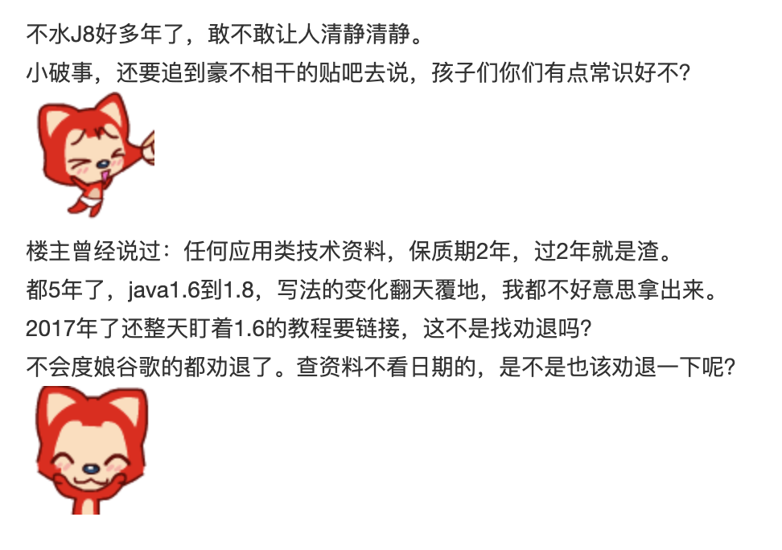

# Tetris

俄罗斯方块Java版本(Cover: 小翼)

**关于笔者**

> 景三，程序员，主要从事Android平台基础架构方面的工作，欢迎交流技术方面的问题，可以去我的[Github](https://github.com/relish-wang)提issue或者发邮件至relish.wang@gmail.com与我交流。
> 
[TOC]

## 效果图

国际惯例先上图。

![默认皮肤][default_view]
![皮肤1][skin1_view]
![皮肤2][skin2_view]

## 如何运行

### 懒人运行
先确保你电脑上装了git和java, 然后随便找个合适的文件下运行下面的代码:
```
git clone https://github.com/relish-wang/Tetris.git && cd Tetris && java -jar Tetris.jar
```

### macOS/Linux
下面方法选其一即可
 - 1 在项目根目录下打开终端执行
```shell
sh start.sh
```
 - 2  在项目根目录下打开终端执行
```shell
./start.sh # 若遇到": permission denied: " 就先执行`chmod +x ./start.sh`
```
### Windows
下面方法选其一即可
 - 1 双击跟目录下`start.bat`文件
 - 2 在项目根目录下打开终端执行
 ```shell
start start.bat
 ```

## 视频下载地址

《俄罗斯方块》视频教程下载地址(包含图片素材和excel讲解图)

链接: https://pan.baidu.com/s/1JOCfsOgEcwq0qvMfK8cqDQ 
提取码: 3u6x 


## 关于原作

此版本的《俄罗斯方块》的原作者小翼于2012年12月12日在[java吧](http://tieba.baidu.com/f?kw=java&ie=utf-8)发布此教程。由于教程在当时质量极高，颇受吧友欢迎。但时至今日, 此教程已不再适合作为新手的练手项目。其本人也曾发帖吐槽，不要再学习此教程，也不要因此事过多打扰他。



### 笔者开此仓库原因：

- 1 纪念当年学习java的岁月

翻了翻大学时期的移动硬盘。"卧槽, 这是什么？" "咦，厉害厉害!" "牵出来溜溜~"

- 2 提供当年的教程和源码

帮助小翼拦(劝)截(退)**不懂事的小朋友**


**Ps:**

小翼吐槽贴: [《【吐槽】不要迷恋哥，J8的破事在J8解决嘛》][tucao]


[tucao]: http://tieba.baidu.com/p/5102819596?pid=106842140390&cid=#106842140390(http://tieba.baidu.com/p/5102819596?pid=106842140390&cid=#106842140390)
[default_view]:./art/default.png
[skin1_view]:./art/skin1.png
[skin2_view]:./art/skin2.png